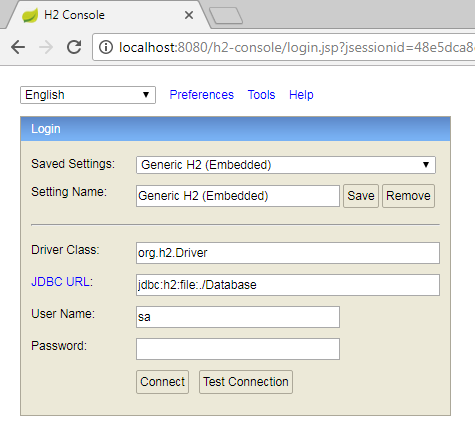

a) Spring Boot with REST, JDBC Template with H2 DB
b) Spring Boot with REST Client, Provier - XML / JSON Response
	http://localhost:8080/persons
	http://localhost:8080/person/1

	using REST Clients
		Postman(Google Chrome plug-in)
		RESTClient (Mozilla Firefox plug-in)
	
POST http://localhost:8080/person 
		
Accept: application/json
Content-Type: application/json
	
Select : BODY and click on "raw"

{
	"id": 2,
	"firstName": "Sathya",
	"lastName": "P",
	"money": 30000
}

<person>
	<firstName>Sathya</firstName>
	<id>5</id>
	<lastName>P</lastName>
	<money>20000.0</money>
</person>

	
JDBC Template

Spring Data 
	- JPA
		- Configuration
		- Programmatic code
		
		Spring Data Commons
		Spring Data JPA
		Spring Data KeyValue
		Spring Data LDAP
		Spring Data MongoDB
		Spring Data Gemfire
		Spring Data REST
		Spring Data Redis
		Spring Data for Apache Cassandra
		Spring Data for Apache Solr
		Spring Data Couchbase (community module)
		Spring Data Elasticsearch (community module)
		Spring Data Neo4j (community module)

		
Web Services
	- REST service
		- Resources
		- Architecture
		- URI
		

		
Spring Security
	- Authentication
	- Authorization
	
	
	mvn dependency:tree
	mvn spring-boot:run
	mvn package
	
	
http://localhost:8080/website/vechicle/list.html
	
http://localhost:8080/h2-console/login.do?jsessionid=910a9926cc30e064ad8bf201769757a4

	JDBC URL: jdbc:h2:file:./Database
	
	
	
	
	
	
	
	[alt text](h2-console.png)
	[alt text](screenshots/h2-console.png)
	[alt text](/screenshots/h2-console.png)
	[alt text](./screenshots/h2-console.png)
	[alt text](../screenshots/h2-console.png)
		
	
JDBC Template
	
	

	
If you want an embedded database please put a supported one on the classpath. 
If you have database settings to be loaded from a particular profile you may need to active it (no profiles are currently active).

Solution:
	comment dependency "spring-boot-starter-data-jpa"
				or
	provide below properties in application.properties
	spring.data

RestClientController
	Create as seperate project
	

