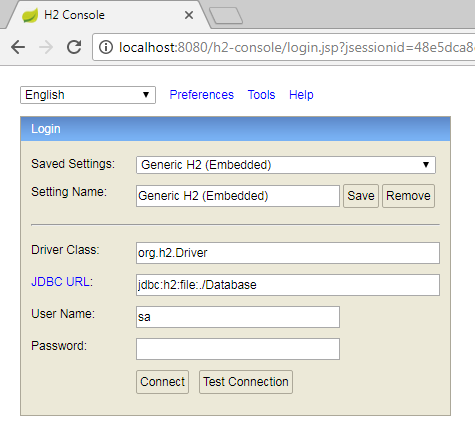

JDBC Template

Spring Data 
	- JPA
		- Configuration
		- Programmatic code
		
		Spring Data Commons
		Spring Data JPA
		Spring Data KeyValue
		Spring Data LDAP
		Spring Data MongoDB
		Spring Data Gemfire
		Spring Data REST
		Spring Data Redis
		Spring Data for Apache Cassandra
		Spring Data for Apache Solr
		Spring Data Couchbase (community module)
		Spring Data Elasticsearch (community module)
		Spring Data Neo4j (community module)

		
Web Services
	- REST service
		- Resources
		- Architecture
		- URI
		

		
Spring Security
	- Authentication
	- Authorization
	
	
	mvn dependency:tree
	mvn spring-boot:run
	mvn package
	
	
http://localhost:8080/website/vechicle/list.html
	
http://localhost:8080/h2-console/login.do?jsessionid=910a9926cc30e064ad8bf201769757a4

	JDBC URL: jdbc:h2:file:./Database
	
	
	
	
	
	
JDBC Template
	
	
